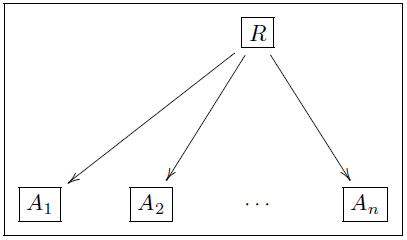

# Olog

\\(
  \usepackage[all]{xy}
  \newcommand{\noin}{\in \!\!\!\!\! / }
  \newcommand{\ds}{\displaystyle}
  \newcommand{\R}{\mathbb{R}}
  \newcommand{\Rd}{\R^{d}}
  \newcommand{\Sr}{\mathcal{S}(\mathbb{R}^{d})}
  \newcommand{\Rt}{\R^{3}}
  \newcommand{\vp}{\varphi}
  \newcommand{\F}{\mathcal{F}}
  \newcommand{\Q}{\mathbb{Q}}
  \newcommand{\C}{\mathscr{C}}
  \newcommand{\D}{\mathscr{D}}
  \newcommand{\V}{\mathbf{V}}
  \newcommand{\pro}{\mathbf{P}}
  \newcommand{\A}{\mathscr{A}}
  \newcommand{\B}{\mathscr{B}}
  \newcommand{\Po}{\mathcal{P}(\Omega)}
  \newcommand{\N}{\mathbb{N}}
  \newcommand{\Rn}{\mathbb{\R}^{n}}
  \newcommand{\Rna}{(\R^{n})^{*}}
\\)

En este trabajo veremos muchos teoremas e ideas aplicándose a ologs; sin embargo, estos no serán estudiados profundamente. En vez de eso, vamos a dar las definiciones y conceptos más necesarios para las aplicaciones. Hay mucho que decir acerca de los ologs, puede encontrarse más información en las referencias. Procedamos a definir algunos términos importantes:

## Tipos
Un **tipo** es un concepto abstracto, es decir, una distinción hecha por el autor. Se representan como cajas que contienen una *frase nominal singular indefinida* (llamada **etiqueta** del tipo). Por ejemplo, las siguientes cajas son tipos:

### Tipos "compuestos"
Muchos tipos tienen estructura compuesta. Por ejemplo

Es una buena práctica exhibir las componentes de un tipo compuesto, usando variables. Por ejemplo,

### Reglas de buena práctica

La caja de texto que representa a un tipo debería:
1. comenzar con un *artículo indefinido (un, una)*
2. referir a una distinción que el autor haya creado y que él reconozca;
3. referir a un concepto con ejemplos documentables;
4. no terminar en signo de puntuación;
5. declarar las variables si el tipo es compuesto.

Las tres primeras reglas aseguran la buena definición del tipo (para el autor del mismo). Las otras aseguran una buena lectura cuando incluyamos aspectos al diagrama. Estas reglas no son rígidas al momento de escribir, pero "en el fondo" deben seguirse.

## Aspectos

Un aspecto de un tipo \\( x \\)  es una forma de ver o considerar \\( x\\). Por ejemplo, una madre tiene como un aspecto el ser una persona, otro aspecto sería el conjunto de hijos que tiene. Formalmente, un aspecto es una función entre dos tipos. Los aspectos se representan con flechas etiquetadas.

Un **camino** en un olog es una secuencia de cajas y flechas ordenada en el sentido de las flechas. El número de flechas es la **longitud** del camino; un camino de longitud cero es una caja.

## Advertencia

El autor de un olog tiene un punto de vista acerca de las cosas, lo cual queda reflejado en su olog. Por ejemplo, algunas personas pueden estar en desacuerdo con el siguiente olog:

Estas discrepancias no implican necesariamente un error en un olog, en realidad es una discrepancia de puntos de vista.

### Leyendo aspectos y caminos

 Para leer un aspecto \\( X \stackrel{f}{\rightarrow} Y \\) primero leemos la etiqueta de \\( X \\) , luego la etiqueta de \\( f \\) y finalmente la etiqueta de \\( Y \\).

Los caminos más largos pueden leerse agregando la palabra "que" (o "quien") entre las etiquetas de los tipos y los aspectos.

En ocasiones es conveniente abreviar las etiquetas, por ejemplo:

A pesar de que este olog no puede leerse "de corrido" como el anterior, es claro el mensaje que se quiere transmitir.

### Convertir relaciones no funcionales en aspectos

Veamos un ejemplo. Observamos que \\(\ulcorner\\)una persona\\(\urcorner \rightarrow \ulcorner \\)un carro\\( \urcorner\\) no es un aspecto por no ser una relación funcional. Para solucionar esto, podríamos considerar \\(\ulcorner\\)una persona\\(\urcorner \rightarrow \ulcorner \\)un conjunto de carros\\( \urcorner\\); este es un aspecto, pero no muestra explícitamente la relación entre un dueño y un carro. Una solución es considerar el siguiente olog:

Este diagrama es más útil porque representa más información. En general, las relaciones que involucran varios tipos pueden expresarse de la forma

### Más reglas de buena práctica

Las etiquetas de un aspecto deberían

1. comenzar con un verbo,
2. producir una oración coherente, cuando se una con las etiquetas de los tipos; y
3. referirse a relaciones funcionales.

## Hechos
La equivalencia de caminos es la causa del gran poder de la Teoría de Categorías. Los **hechos** son simplemente "equivalencias de caminos" en un olog.

Dado un olog, un autor quizás quiera indicar que dos caminos son equivalentes (por ejemplo, para dar una definición). Por ejemplo, consideremos los dos caminos entre \\( A \\) y \\( C \\) en el olog

Sabemos que una madre es una mujer es un progenitor mujer, luego diremos que los dos caminos entre \\(A \\) y \\( C \\) son equivalentes. Matemáticamente hablando, decir que los caminos son equivalente significa que el diagrama dado *conmuta*. Los "ologs conmutativos" son llamados **hechos**. Usualmente, cuando no haya ambigüedad, la existencia de un hecho se indicará usando \\( \checkmark\\) dentro del diagrama.
