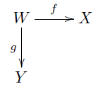
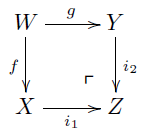
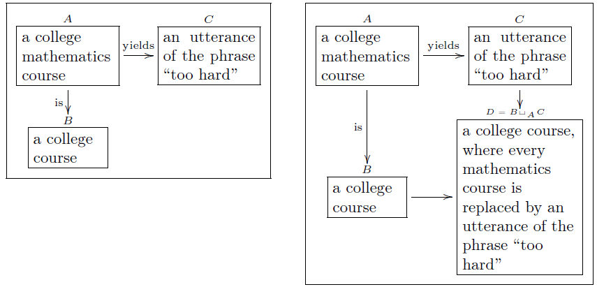
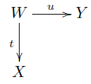
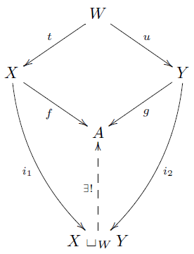
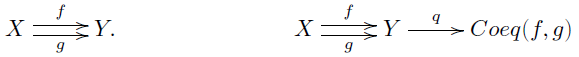

# Colímites finitos en *Set*

\\(
  \newcommand{\noin}{\in \!\!\!\!\! / }
  \newcommand{\ds}{\displaystyle}
  \newcommand{\R}{\mathbb{R}}
  \newcommand{\Rd}{\R^{d}}
  \newcommand{\Sr}{\mathcal{S}(\mathbb{R}^{d})}
  \newcommand{\Rt}{\R^{3}}
  \newcommand{\vp}{\varphi}
  \newcommand{\F}{\mathcal{F}}
  \newcommand{\Q}{\mathbb{Q}}
  \newcommand{\C}{\mathscr{C}}
  \newcommand{\D}{\mathscr{D}}
  \newcommand{\V}{\mathbf{V}}
  \newcommand{\pro}{\mathbf{P}}
  \newcommand{\A}{\mathscr{A}}
  \newcommand{\B}{\mathscr{B}}
  \newcommand{\Po}{\mathcal{P}(\Omega)}
  \newcommand{\N}{\mathbb{N}}
  \newcommand{\Rn}{\mathbb{\R}^{n}}
  \newcommand{\Rna}{(\R^{n})^{*}}
  \newcommand{\xyz}{X \times_{Z} Y }
\\)

## Pushout

Consideremos  el siguiente diagrama (1):

Su **suma fibrada** denotada por \\( X \sqcup_{W} Y \\), se define como el cociente  de \\( X \sqcup W \sqcup Y \\) entre la relación de equivalencia \\( \sim \\), generada por \\( w \sim f(w)\\) y \\( w \sim g(w)\\) para todo \\( w \in W \\).

Las inclusiones canónicas se denotan por \\( i_{1}: X \rightarrow X \sqcup_{W} Y \\) y \\( i_{2}: Y \rightarrow X \sqcup_{W} Y \\). Por ejemplo, para todo \\(x \in X \\): \\( i_{1}(x) = \overline{x} \\). Cabe resaltar que estas inclusiones *no son inyectivas*. Observamos que si \\( Z = X \sqcup_{W} Y \\) entonces el siguiente diagrama conmuta:

En general, suponiendo asumiendo la configuración del diagrama (1), se define el **pushout de \\( X\\) y \\(Y \\) sobre \\( W\\)** como cualquier conjunto \\( Z \\) que es isomorfo a \\( X \sqcup_{W} Y \\). El símbolo \\( \ulcorner\\) indica que \\( Z \\) es el pushout.

*Los pushouts son útiles para unir cosas*. Si queremos \\( B \\) y \\( C\\), usando \\( A \\) como goma y ciertas funciones (*instrucciones de pegado*). El resultado es el pushout \\( B \sqcup_{A} C \\). Más adelante, *cuando formalizemos todas estas ideas*, veremos aplicaciones de esto en Topología.

### Ejemplo 1

Supongamos que \\( X = [ 0,1 ] \\), \\(Y= [1,2]\\) y \\(W = \lbrace 1 \rbrace \\). Si \\( f =g = ( 1 \mapsto 1 ) \\), entonces el pushout es \\( X \sqcup_{W} Y \simeq [0,2] \\).

### Ejemplo 2
El diagrama de la derecha es el pullback del de la izquierda (*observar que las flechas son inyectivas*):

Primero, estamos diciendo que si encontramos un curso de matemática universitario en una lista, en lugar de decir su nombre, decimos "muy difícil". Luego, para formar \\( D \\), comenzamos juntando \\( B \\) y \\( C \\) y después consideramos cada elemento en \\( A \\) como un curso y como "algo que implique la exclamación "muy difícil" a la vez. La etiqueta elegida comienza con "\\( B \\)", ya que así es más natural.

### Propiedad universal del pushout
> Sea un diagrama  Para todo conjunto \\( A \\) y funciones \\( f: X \rightarrow A \\)  y \\( g:  Y \rightarrow A\\) tales que \\(f \circ t = g \circ u \\) , existe una única función \\( \displaystyle \left\lbrace {f \atop g } \right. : X \sqcup_{W} Y \rightarrow A \\) haciendo que el siguiente diagrama conmmute: 
, donde \\( \displaystyle  f = \left\lbrace {f \atop g } \right. \circ i_{1}  \\) y \\( \displaystyle  g = \left\lbrace {f \atop g } \right. \circ i_{2}  \\).

## Otros colímites finitos

Consideremos los siguientes diagramas:

El **coequalizador de \\( f \\) y \\( g \\)**  es el diagrama conmutativo de la derecha, donde \\[ Coeq (f,g):= Y / f(x) \sim g(c) \\]

Un **objeto inicial** es una conjunto \\( S \\ = tal que para todo conjunto \\(A \\), existe una única función \\( S \rightarrow A\\).
