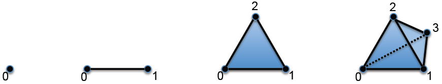
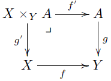
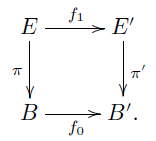
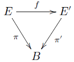

# Otra nociones en **Set**

\\(
  \newcommand{\noin}{\in \!\!\!\!\! / }
  \newcommand{\ds}{\displaystyle}
  \newcommand{\R}{\mathbb{R}}
  \newcommand{\Rd}{\R^{d}}
  \newcommand{\Sr}{\mathcal{S}(\mathbb{R}^{d})}
  \newcommand{\Rt}{\R^{3}}
  \newcommand{\vp}{\varphi}
  \newcommand{\F}{\mathcal{F}}
  \newcommand{\Q}{\mathbb{Q}}
  \newcommand{\C}{\mathscr{C}}
  \newcommand{\D}{\mathscr{D}}
  \newcommand{\V}{\mathbf{V}}
  \newcommand{\pro}{\mathbf{P}}
  \newcommand{\A}{\mathscr{A}}
  \newcommand{\B}{\mathscr{B}}
  \newcommand{\Po}{\mathcal{P}}
  \newcommand{\N}{\mathbb{N}}
  \newcommand{\Rn}{\mathbb{\R}^{n}}
  \newcommand{\Rna}{(\R^{n})^{*}}
\\)

## Retracciones

Sean las funciones \\( f: X \rightarrow Y\\) y \\( g: Y \rightarrow X \\) tales que \\(g \circ f = id_{X}\\). En este caso, \\(f \\) es llamada una **sección retráctil** y \\(g\\), **proyección retráctil**.

## Currying

**Currying** nos permite transformar una función de varios parámetros a otra de un solo parámetro. Para entender esto, consideremos la siguiente proposición

### Proposición del currying
Sea \\( A\\) un conjunto. Para cualquier par de conjuntos \\( X,Y\\), existe una biyección \\[ \phi: \hom_{Set} (X \times A , Y )  \ds \stackrel{\simeq}{\rightarrow} \hom_{Set} (X,Y ^{A})  \\]

## Complejos simpliciales

Sea \\( V \\) un conjunto y \\( \Po (V) \\) Un subconjunto \\( X \subset \Po(V) \\) es llamdo **cerrado por inclusión** si, para todo \\( u \in X \\) y todo \\( u' \subset u \\), tenemos \\( u' \in X \\). Decimos que \\( X \\) contiene **todos los átomos** si para todo \\( v \in V \\), el conjunto \\( \lbrace v \rbrace \\) es un elemento de \\( X \\).

Un **complejo simplicial** es un par \\( (V,X) \\), donde \\( V \\) es un conjunto y \\( X \Po(X) \\) es un subconjunto cerrado por inclusión y que contiene todos los átomos. Los elementos de \\( X \\) son llamados **simpliciales**.

El conjunto de símplices con cardinal \\( n+1 \\) se denota por \\( X_{n} \\) y cada elemento \\( u\in X_{n} \\) es un **n-simplex**. Como \\(X \\) contiene todos los átomos, tenemos que \\(X_{0} \simeq V \\), por lo que los elementos de \\( X_{0} \\) también son llamados **vértices**; los 1-símplices suelen ser llamados **bordes**. A veces denotaremos \\( (X,V) \\) simplemente por \\( X \\).

Para dibujar un complejo \\(X \\), primero dibujamos cada vértice como un punto. Luego, para \\( x = \lbrace v,v'\rbrace \in X_{1} \\), dibujamos una línea uniendo \\( v \\) con \\( v' \\). Luego, para \\( y = \lbrace w,w',w'' \rbrace \in X_{2}\\), dibujamos un triángulo sombreado, uniéndo sus vértices

### Los n-símplices \\(\Delta ^{n} \\)
Sean \\( n \in \N \\) y \\( V= \underline{n+1}\\). El **n-símplex**, denotado por \\(\Delta^{n}\\), son los complejos simpliciales \\( \Po(V)\\), es decir, tomamos como subconjunto todo el conjunto potencia. A continuación se muestran ilustraciones de \\( \Delta^{0}, \Delta^{1}, \Delta^{2}\\) y \\( \Delta^{3}\\):

## Subobjeto clasificador

El **subobjeto clasificador** para **Set**, denotado por \\( \Omega \\), es el conjunto \\( \Omega:= \lbrace Verdadero, Falso \rbrace \\), junto con la función \\( \lbrace * \rbrace \rightarrow \Omega \\) que manda el único elemento a \\(Verdadero\\).

### Proposición:
> Sea \\( B \\) un conjunto. Existe un isomorfismo \\[ \hom_{Set} (B , \Omega) \stackrel{\simeq}{\rightarrow} \Po(B) \\].

Luego, dado \\(B \subset B \\), podemos definir la **función característica** de \\( B' ) en \\( B\\) como la función \\( B \rightarrow \Omega \\) correspondiente a \\(B' \\) en la proposición.

## Monomorfismos, epimorfismos

Sea \\( f : X \rightarrow Y \\) una función:
1. Decimos que \\( f \\) es un **monomorfismo** si para todo conjunto \\(A \\) y funciones \\( g, g' : A \rightarrow X\\), \\( f \circ g = f \circ g'\\) implica \\(g = g' \\)

2. Decimos que \\( f \\) es un **monomorfismo** si para todo conjunto \\(B \\) y funciones \\( h, h' : A \rightarrow X\\), \\( h \circ f = h' \circ f'\\) implica \\(h = h' \\).

### Proposición fundamental

> Sea \\( f :X  \rightarrow Y \\) una función. \\( f \\) es inyectiva si y solo si es un monomorfismo; \\( f \\) es suryectiva si y solo si es un epimorfismo.

### Monomorfismos y pullbacks

> Sea \\( f :X  \rightarrow Y \\) un monomorfismo. Entonces para toda función \\( g : A \rightarrow Y\\), el mapa f' : X \times_{Y} A \rightarrow \\) en el diagrama  es un monomorfismo.

## Categorías relacionadas con **Set**

### Multiconjuntos

Un **multiconjunto** es un terna \\( X = (E, B , \pi) \\) donde \\(E\\) y \\( B\\) son conjuntos y \\(\pi : E \rightarrow B \\) es una función suryectiva. Los elementos de \\(E \\) son llamdos **instancias** de \\(X \\); los elementos de \\( B \\), **etiquetas** de \\(X \\) y \\(\pi\\), **función de etiquetado** de \\(X \\). Dado un elemento \\( x \in B\\), \\( \lvert (pi^{-1}(x) \rvert \\) es llamada la **multiplicidad** de \\(x\\).

Por ejemplo, *el contenedor* `counter` de Python representa un multiconjunto.

Sean \\( X = (E, B , \pi) \\) y \\( X = (E', B' , \pi ') \\) Un **morfismo** entre \\( X \\) y \\( Y \\), denotado por \\(f: X \rightarrow Y \\), es un par ordenado \\( (f_{1}, f_{0} ) \\) tales que \\( f_{1}: E \rightarrow E' \\) y \\( f_{0} : B \rightarrow B' \\) son funciones tales que  el siguiente diagrama conmuta:

### Conjuntos relativos

Son parecidos a los multiconjuntos, con la diferencia que cada elemento tiene una sola etiqueta que lo identifica, por lo que \\( E = B\\). Formalizando:

Sea \\(B \\) un conjunto. Un **conjunto relativo sobre \\( B \\)**, o un **conjunto sobre \\(B\\)**, es un par \\( (E, \pi )\\) tal que \\( E \\) es un conjunto y \\( pi: E \rightarrow B \\) es una función.

Un **morfismo** entre conjuntos relativos sobre \\( B \\), denotado \\(f: (E, \pi) \rightarrow (E ',\pi ') \\), es una función \\( f: E \rightarrow E'\\) tal que el siguiente diagrama conmuta

### Conjuntos indexados

Sea \\( A \\) un conjunto. Un **conjunto \\(A\\)-indexado** es una colección de conjuntos \\( \lbrace S_{a} \rbrace_{a \in A} \\).

Si \\( \lbrace R_{a} \rbrace_{a \in A} \\) es otro conjunto indexado, un **morfismo de conjuntos \\( A \\)-indexados** entre \\( \lbrace S_{a} \rbrace_{a \in A} \\) y \\( \lbrace R_{a} \rbrace_{a \in A} \\) es una colección de funciones \\[ \lbrace f_{a}: S_{a} \rightarrow R_{a} \rbrace_{a \in A} \\]
